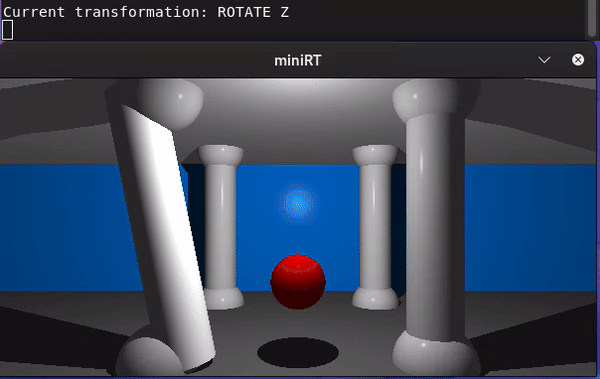

# minirt
A raytracer written in C using the mlx library for graphics management. Built for 42Porto programming school.



### Try the project
Clone the repository, and run ```make``` in root. You can then run the resulting executable, passing one of the maps as argument or create your own map.

### A full mathematical explanation for every single step of the process is in progress!
You can read it [here](https://www.notion.so/miniRT-a-simple-ray-tracer-113381a9a29680d39341c83a9490890e?pvs=4).

### Controls:
There are three different variables that can be combined to apply a change to the scene: the shape to be transformed, the type of transformation and the direction of that transformation. The current shape will be highlighted, and the type of transformation will be writen on the terminal. 
- Cycle through shapes: **S**;
- Camera: **C**;
- Light: **L**;
- Cycle through transformation types: **left/right arrows**;
- Apply transformation: **up/down arrows**.

### Acknowledgements
This project was made in collaboration with [Joao Fonseca](https://github.com/Joao613). Thanks for working so hard with me!

Other people who influenced the project:
- [Jhonas](https://github.com/Jburlama) (who is also making an excellent, less in-depth but faster-paced, documentation of the same project,
better suited for those who already have some basics of what is going on. Definitely check it out!);
- [Uatila](https://github.com/Uatilla);
- [Ana](https://github.com/someoneisanna) (who suggested the book which I ended up using to complete miniRT - [The Ray Tracer Challenge](http://raytracerchallenge.com/));
- [Ana](https://github.com/aamaral-42) (different Ana).
